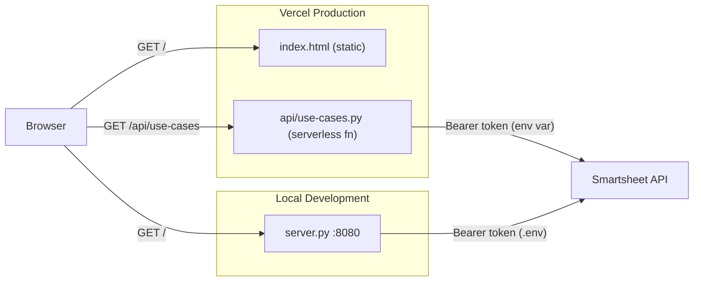

# AI Portfolio — Executive Board Summary

A polished, print-ready executive one-pager for the **"Driving Results with AI"** initiative portfolio. Designed for board of directors and executive leadership review.

**Live site:** [innovation-dashboard-flame.vercel.app](https://innovation-dashboard-flame.vercel.app)

## Architecture

The dashboard supports two deployment modes: **Vercel** (production) and a **local Python server** (development). Both serve the same static HTML page and proxy the Smartsheet API so the token never reaches the browser.



| Component | Purpose |
|---|---|
| `index.html` | Single-page dashboard (HTML + inline CSS/JS). Fetches data from `/api/use-cases` or local JSON. |
| `api/use-cases.py` | Vercel Python serverless function. Proxies the Smartsheet API using the token from env vars. |
| `server.py` | Local dev server. Serves static files + Smartsheet proxy. Auto-loads `.env`. |
| `data/smartsheet_config.json` | Sheet ID and column name mapping (shared by both server and serverless fn). |
| `data/use_cases.json` | Offline/manual data file. Used when `DATA_SOURCE = "json"`. |

## Project Structure

```
├── index.html                  # Dashboard (root page, print/PDF-ready)
├── board-summary/
│   └── index.html              # Redirect to / (legacy URL compat)
├── api/
│   └── use-cases.py            # Vercel serverless function (Smartsheet proxy)
├── data/
│   ├── use_cases.json          # Local/offline data
│   └── smartsheet_config.json  # Smartsheet sheet ID & column mapping
├── server.py                   # Local dev server + Smartsheet API proxy
├── vercel.json                 # Vercel deployment config
├── .env.example                # Template for API token
├── .gitignore
└── README.md
```

## Prerequisites

- **Python 3.9+** (ships with macOS; verify with `python3 --version`)
- A modern browser (Chrome, Edge, Safari, Firefox)
- *(Optional)* A Smartsheet account with API access for live data mode

## Quick Start (Local Development)

```bash
# 1. Clone the repo
git clone <repo-url> && cd Innovation-Dashboard

# 2. (Optional) Set up Smartsheet — copy .env and add your token
cp .env.example .env
# Edit .env and paste your Smartsheet API token

# 3. Start the server
python3 server.py

# 4. Open in your browser
open http://localhost:8080
```

The default data source is **Smartsheet** (live). If you have a `.env` file with a valid token, the dashboard will pull live data immediately. Without a token, you can switch to JSON mode (see below).

To export as PDF, use **Cmd + P** (or Ctrl + P) and select **Save as PDF**.

## Deploy to Vercel

The project is ready to deploy to [Vercel](https://vercel.com) with zero build configuration. The dashboard is served as a static page at the root URL, and the Smartsheet proxy runs as a Python serverless function at `/api/use-cases`.

### 1. Import the repo

1. Go to [vercel.com/new](https://vercel.com/new)
2. Import your GitHub repository
3. Leave all build settings at their defaults -- no framework, no build command needed

### 2. Add your API token

1. In the Vercel project dashboard, go to **Settings → Environment Variables**
2. Add a variable:
   - **Name:** `SMARTSHEET_API_TOKEN`
   - **Value:** your Smartsheet API token
3. Click **Save**

### 3. Deploy

Click **Deploy** (or push to your main branch). The site will be live at your Vercel URL with live Smartsheet data -- no further configuration needed.

> **How it works:** The `api/use-cases.py` serverless function reads the token from the environment variable, calls the Smartsheet API, and returns the data to the browser. The API key never reaches the client. Responses are edge-cached for 60 seconds with stale-while-revalidate for performance.

## Switching Between JSON and Smartsheet

The data source is controlled by a single constant in `index.html` (near line 468):

```js
const DATA_SOURCE = "smartsheet";  // ← live from Smartsheet API (default)
// const DATA_SOURCE = "json";     // ← local file (offline/manual mode)
```

The default is `"smartsheet"`. To switch, comment out one line and uncomment the other, then refresh.

| Mode | What it does | Token required? |
|---|---|---|
| `"smartsheet"` | Fetches live data from Smartsheet via the API proxy | Yes |
| `"json"` | Reads `data/use_cases.json` -- fully offline, no network needed | No |

> **Note:** The local dev server auto-loads your `.env` file at startup. You don't need to run `source .env` (though that still works too).

## Smartsheet Setup

This dashboard is configured to pull live data from the **[AI Innovation List](https://app.smartsheet.com/sheets/c9xQm5P5Vp4Gph8Xq2hCw9jWw9vWJjC8R78xchh1?view=grid)** Smartsheet. When running in Smartsheet mode, the dashboard reflects the current state of that sheet -- any changes made in Smartsheet will appear on the next page refresh.

### Smartsheet Columns

The dashboard reads the following columns from the AI Innovation List. When editing the sheet, these are the columns that drive the dashboard:

| Smartsheet Column | Dashboard Field | How it's used |
|---|---|---|
| **Project Name** | Initiative name | Displayed on cards, table rows, and highlights |
| **Status** | Pipeline stage | Groups initiatives into columns: `In Production`, `POC Done`, `POC In Progress` |
| **Department** | Owning department | Shown in the portfolio table and used for highlight cards |
| **Sponsor** | Executive owner | Displayed in the table; `TBD` values trigger a "next steps" recommendation |
| **Headline Impact** | Business impact summary | Shown on cards/table; dollar amounts (`$300K`) and FTE counts (`4-6 FTEs`) are auto-parsed to compute KPI totals |

> **Tip:** Only rows with a **Project Name** are included. To hide a row from the dashboard, clear its Project Name cell.

### 1. Get your API token

1. Log in to [Smartsheet](https://app.smartsheet.com)
2. Click your **profile icon** (bottom-left) → **Personal Settings**
3. Select **API Access** → **Generate new access token**
4. Copy the token

### 2. Configure locally

Create a `.env` file in the project root (this file is git-ignored):

```bash
cp .env.example .env
```

Then paste your token:

```
export SMARTSHEET_API_TOKEN=your_token_here
```

The sheet ID and column mapping are already configured in `data/smartsheet_config.json` for the AI Innovation List. You should not need to change them unless the sheet or its column names change.

### 3. Start the server

```bash
python3 server.py
```

The server auto-loads the `.env` file on startup. The dashboard defaults to Smartsheet mode, so live data will load immediately.

## Updating the JSON File (Manual Mode)

If you prefer to manage data manually instead of using Smartsheet, edit `data/use_cases.json` directly.

### Adding a new initiative

Add an entry to the `use_cases` array:

```json
{
  "id": 15,
  "name": "New Initiative",
  "status": "POC In Progress",
  "department": "Engineering",
  "owner": "J. Smith",
  "headline_impact": "$500K annual savings; 3 FTEs"
}
```

### Required fields

| Field | Description | Valid values |
|---|---|---|
| `id` | Unique integer | Any unique number |
| `name` | Initiative name | Free text |
| `status` | Pipeline stage | `"In Production"`, `"POC Done"`, `"POC In Progress"` |
| `department` | Owning department | Free text |
| `owner` | Executive sponsor | Free text (use `"TBD"` if unassigned) |
| `headline_impact` | Business impact summary | Free text -- dollar amounts (`$300K`) and FTE counts (`4-6 FTEs`) are auto-parsed for KPIs |

### Removing an initiative

Delete the entire `{ ... }` block for that entry and ensure the remaining JSON array has no trailing commas.

After editing, refresh the page (make sure `DATA_SOURCE = "json"`).

## Features

- **4 headline KPI boxes** -- total initiatives, estimated annual impact, FTE savings, production count (all computed from data)
- **3-column initiative pipeline** -- In Production, POC Done, POC In Progress with individual cards
- **Full portfolio table** -- status, use case, department, headline impact, owner
- **3 strategic highlight cards** -- auto-generated from live data
- **Recommended next steps** -- auto-generated based on data patterns (TBD owners, unscored items, etc.)
- **Dark mode toggle** -- persisted across sessions; applies to exports too
- **Export to slide** -- three buttons capture page sections as 1920x1080 PNG images sized for 16:9 PowerPoint slides
- **Print-optimized layout** -- letter-size, clean PDF export via Cmd/Ctrl + P
- **Plug-and-play data source** -- switch between local JSON and live Smartsheet with one line change
- **Vercel-ready** -- deploys with zero config; Python serverless function proxies the API securely
